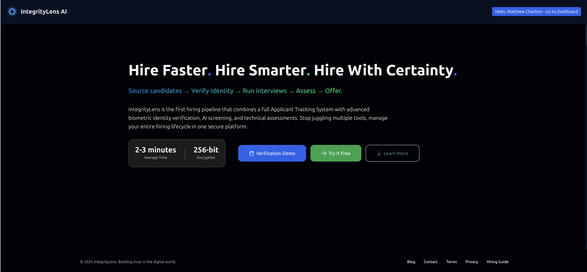
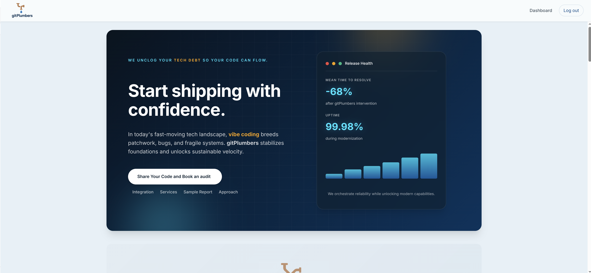
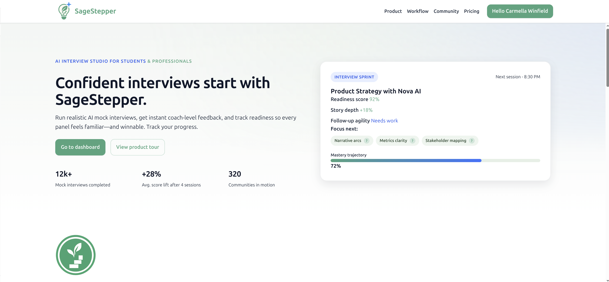
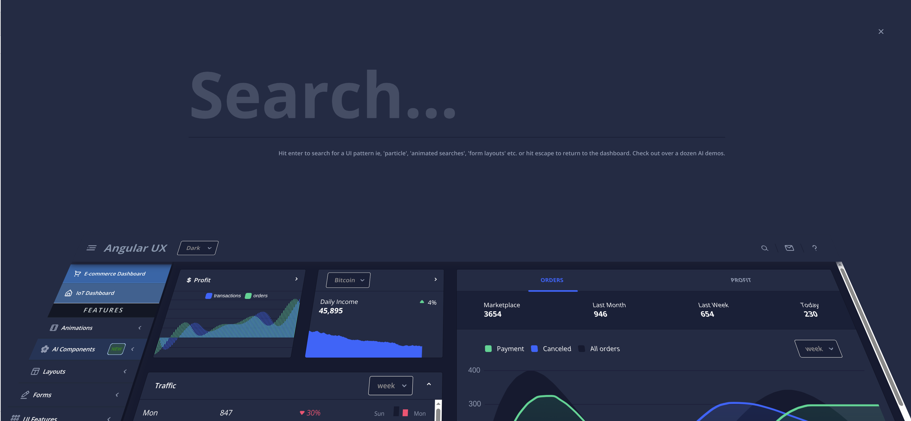
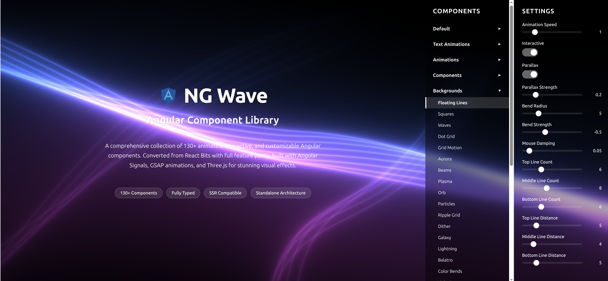

## Hi there 👋

2025 has been an exceptionally productive year: I developed **four full-stack, cloud-based Angular applications**, created a **new Three.js animation component library for Angular**, and provided consultancy services to **one of the largest companies in the Telecommunications and Mass Media sector**. 

*If you're looking to accelerate your engineering projects, streamline development, or bring cutting-edge web experiences to life, I can help turn your vision into reality—let's build something remarkable together.*

### 📊 GitHub Stats

  
  

  

> **Note:** If stats don't display, the public services may be experiencing downtime. Consider deploying your own instance for reliability. See [github-readme-stats](https://github.com/anuraghazra/github-readme-stats) for setup instructions.

---

### 🚀 [DeepSpeed AI](https://deepspeedai.com)

**[Automate the work that's wasting your team's time — in 30 days.](https://deepspeedai.com)**

[We deploy automation, copilots, and executive intelligence with built-in governance, audit trails, and data controls — so your team gets real time back without adding risk. With instant budget wizard.](https://deepspeedai.com)

---

### 🔍 [IntegrityLens AI](https://getintegritylens.com)

[**IntegrityLens AI is revolutionizing the hiring landscape** with our comprehensive candidate verification and technical assessment platform. We combine cutting-edge AI with multi-layered authentication to ensure the integrity of your entire hiring process.](https://getintegritylens.com)

#### 📹 Platform Demos

**🎬 Showcase Reel** | **🤖 AI Interview Demo**

> **Note:** GitHub doesn't support inline video playback in READMEs. Click the badges above to watch the videos.

---

### 🔧 [gitPlumbers](https://gitplumbers.com)

[At **gitPlumbers**, we stabilize and modernize AI-assisted and legacy systems so teams can ship faster, scale confidently, and innovate without chaos.](https://gitplumbers.com)

---

### 🎯 [SageStepper](https://sagestepper.com)

[**SageStepper is the AI interview studio** built for students and professionals who want to turn practice into panel-ready confidence. Our platform pairs adaptive mock interviews with auto-coached feedback so you can drill what matters, see your gaps, and iterate fast.](https://sagestepper.com)

---

### 🎨 [Angular UX Showcase](https://angularux.com)

[My Angular showcase featuring **over 100 demos** demonstrating advanced Angular patterns, best practices, and cutting-edge implementations.](https://angularux.com)

---

### 🌊 [Angular Component Library (ngWave)](https://ngwave.angularux.com/)

[A comprehensive collection of **130+ animated, interactive, and customizable Angular components**. Converted from React Bits with full feature parity, built with Angular Signals, GSAP animations, and Three.js for stunning visual effects.](https://ngwave.angularux.com/)

---

## 🛠️ Tech Stack

### Frontend

### Backend & Cloud

### Tools & Others

---

## 💼 Let's Connect

👯 **I'm looking to collaborate with a GTM cofounder**

💻 **Currently available for contract work**, and may consider full-time for the perfect match.

### 🌐 Connect with me

---
